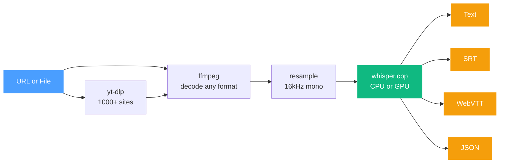

# transcriber

<p align="center">
  <a href="https://crates.io/crates/transcriber"></a>
  <a href="https://crates.io/crates/transcriber"></a>
  <a href="https://docs.rs/transcriber"></a>
  <a href="https://github.com/claymore666/transcriber/blob/main/LICENSE-MIT"></a>
  <a href="https://github.com/claymore666/transcriber/issues"></a>
  <a href="https://github.com/claymore666/transcriber/stargazers"></a>
</p>

Give it a URL or a file, get back a transcript with timestamps.

Built on [whisper.cpp](https://github.com/ggerganov/whisper.cpp) via [whisper-rs](https://github.com/tazz4843/whisper-rs). Handles the whole pipeline — downloading, audio decoding, resampling, transcription, output formatting — so you don't have to glue it together yourself.

## How it works



**Without transcriber** you'd wire up yt-dlp, ffmpeg, sample rate conversion, and whisper yourself — different tools, different formats, lots of glue code. **With transcriber** it's one function call:

```rust
let transcript = transcriber::transcribe(url).await?;
```

## Quick start

```rust
let transcript = transcriber::transcribe("https://youtube.com/watch?v=dQw4w9WgXcQ").await?;
println!("{}", transcript.text());
```

Or from a local file:

```rust
let transcript = transcriber::transcribe_file("meeting.mp3").await?;

// Get subtitles
println!("{}", transcript.to_srt());
println!("{}", transcript.to_vtt());

// Or structured data
let json = transcript.to_json_pretty()?;
```

Models are downloaded automatically from HuggingFace on first use and cached locally.

## Install

```toml
[dependencies]
transcriber = "0.1"
```

For GPU acceleration:

```toml
[dependencies]
transcriber = { version = "0.1", features = ["cuda"] }
# or
transcriber = { version = "0.1", features = ["vulkan"] }
```

## CLI

```sh
cargo install transcriber-cli

# Transcribe a YouTube video
transcriber-cli https://youtube.com/watch?v=... --format srt --output subtitles.srt

# Transcribe a local file
transcriber-cli recording.mp3 --model small --language de

# List available models
transcriber-cli --list-models
```

## Options

```rust
use transcriber::{TranscribeOptions, Model};

let opts = TranscribeOptions::new()
    .model(Model::LargeV3Turbo)
    .language("de")?
    .word_timestamps(true)
    .translate(true)           // translate to English
    .gpu(true)
    .beam_size(5);

let transcript = transcriber::transcribe_with_options(url, &opts).await?;

for segment in &transcript.segments {
    println!("[{:.1}s - {:.1}s] {}", segment.start, segment.end, segment.text);
}
```

## What it supports

**Audio formats**: anything ffmpeg can handle — mp3, wav, ogg, opus, flac, aac, m4a, webm, and more.

**URL downloading**: YouTube and [1000+ other sites](https://github.com/yt-dlp/yt-dlp/blob/master/supportedsites.md) via yt-dlp.

**Output formats**: plain text, SRT, WebVTT, JSON.

**Models**: tiny through large-v3-turbo, plus custom GGML files.

**Languages**: 100 languages with auto-detection.

## Requirements

- **ffmpeg** — for audio decoding (`apt install ffmpeg` / `brew install ffmpeg`)
- **yt-dlp** — for URL downloads (`pip install yt-dlp`). Not needed if you only use local files — build without the `download` feature to drop this dependency.

## Feature flags

| Flag | Default | What it does |
|------|---------|-------------|
| `download` | yes | URL downloading via yt-dlp |
| `cuda` | no | NVIDIA GPU acceleration |
| `vulkan` | no | Vulkan GPU acceleration |

## License

Licensed under either of [Apache License, Version 2.0](LICENSE-APACHE) or [MIT license](LICENSE-MIT) at your option.
